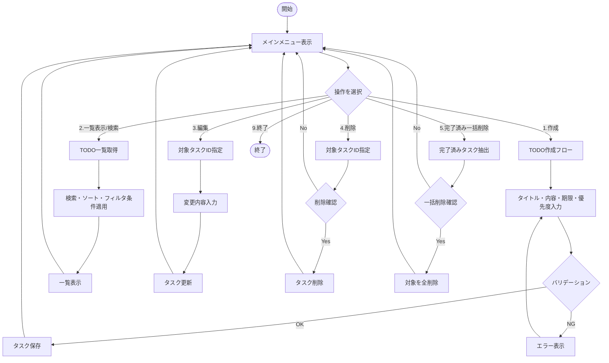
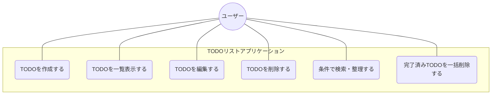
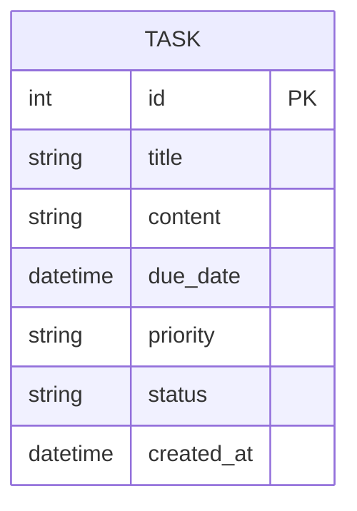

# 要求分析図面

## 1. 業務フロー図

```mermaid
flowchart TD
    Start([開始]) --> MainMenu[メインメニュー表示]
    MainMenu --> Select{操作を選択}

    Select -- 1.作成 --> Create[TODO作成フロー]
    Create --> InputInfo[タイトル・内容・期限・優先度入力]
    InputInfo --> Validate{バリデーション}
    Validate -- OK --> Save[タスク保存]
    Validate -- NG --> ShowError[エラー表示]
    ShowError --> InputInfo
    Save --> MainMenu

    Select -- 2.一覧表示/検索 --> List[TODO一覧取得]
    List --> SetFilter[検索・ソート・フィルタ条件適用]
    SetFilter --> Display[一覧表示]
    Display --> MainMenu

    Select -- 3.編集 --> SelectEdit[対象タスクID指定]
    SelectEdit --> EditInput[変更内容入力]
    EditInput --> Update[タスク更新]
    Update --> MainMenu

    Select -- 4.削除 --> SelectDel[対象タスクID指定]
    SelectDel --> ConfirmDel{削除確認}
    ConfirmDel -- Yes --> Delete[タスク削除]
    ConfirmDel -- No --> MainMenu
    Delete --> MainMenu

    Select -- 5.完了済み一括削除 --> BulkDel[完了済みタスク抽出]
    BulkDel --> ConfirmBulk{一括削除確認}
    ConfirmBulk -- Yes --> DeleteAll[対象を全削除]
    ConfirmBulk -- No --> MainMenu
    DeleteAll --> MainMenu

    Select -- 9.終了 --> End([終了])
```

## 2. ユースケース図

```mermaid
graph TD
    User((ユーザー))
    subgraph "TODOリストアプリケーション"
        UC1(TODOを作成する)
        UC2(TODOを一覧表示する)
        UC3(TODOを編集する)
        UC4(TODOを削除する)
        UC5(条件で検索・整理する)
        UC6(完了済みTODOを一括削除する)
    end
    User --- UC1
    User --- UC2
    User --- UC3
    User --- UC4
    User --- UC5
    User --- UC6
```

## 3. 概念設計（ER図）

```mermaid
erDiagram
    TASK {
        int id PK
        string title
        string content
        datetime due_date
        string priority
        string status
        datetime created_at
    }
```
