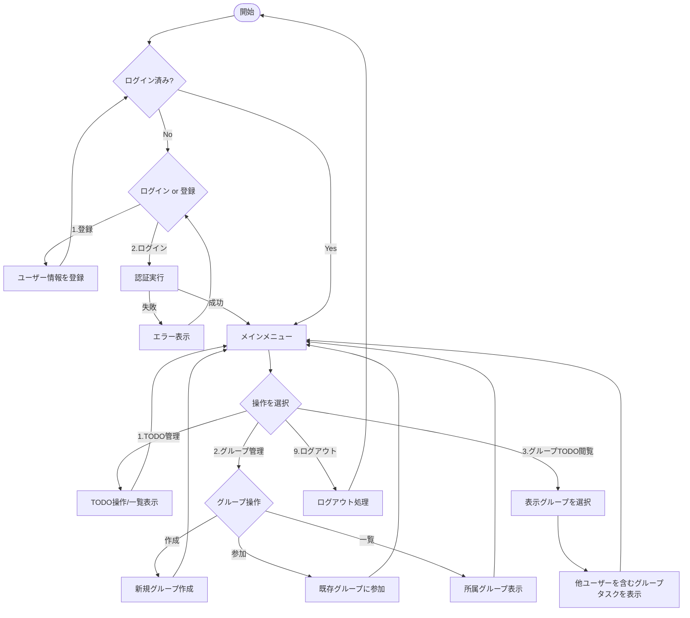
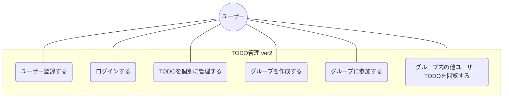
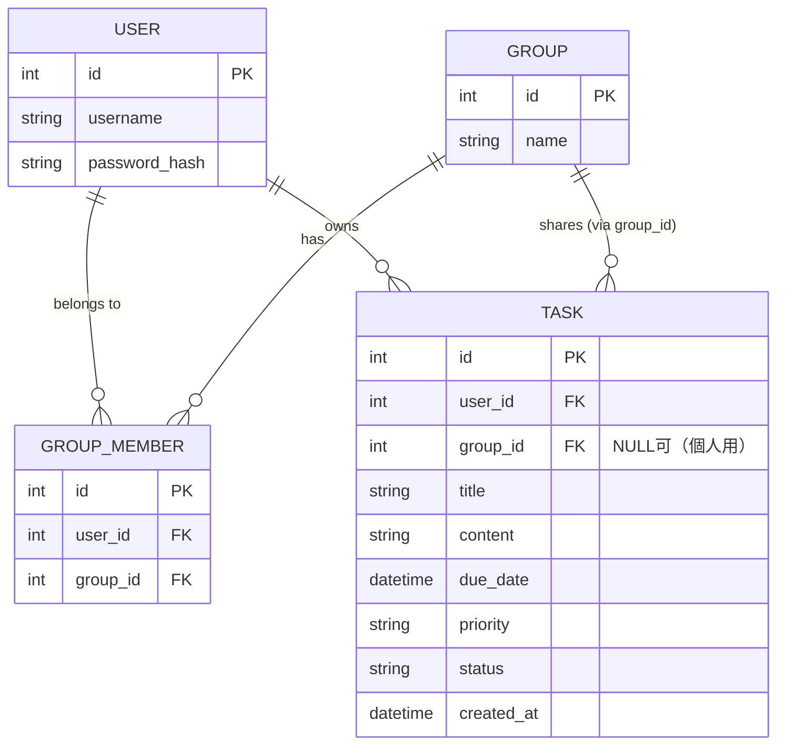

# 要求分析図面 (ver2: ユーザー・グループ管理)

## 1. 業務フロー図

```mermaid
flowchart TD
    Start([開始]) --> LoginCheck{ログイン済み?}

    LoginCheck -- No --> AuthChoice{ログイン or 登録}
    AuthChoice -- 1.登録 --> Register[ユーザー情報を登録]
    Register --> LoginCheck
    AuthChoice -- 2.ログイン --> Login[認証実行]
    Login -- 失敗 --> ShowAuthErr[エラー表示]
    ShowAuthErr --> AuthChoice
    Login -- 成功 --> MainMenu[メインメニュー]

    LoginCheck -- Yes --> MainMenu

    MainMenu --> SelectAction{操作を選択}

    SelectAction -- 1.TODO管理 --> TodoSubMenu[TODO操作/一覧表示]
    TodoSubMenu --> MainMenu

    SelectAction -- 2.グループ管理 --> GroupSubMenu{グループ操作}
    GroupSubMenu -- 作成 --> CreateGroup[新規グループ作成]
    GroupSubMenu -- 参加 --> JoinGroup[既存グループに参加]
    GroupSubMenu -- 一覧 --> ListGroups[所属グループ表示]
    CreateGroup --> MainMenu
    JoinGroup --> MainMenu
    ListGroups --> MainMenu

    SelectAction -- 3.グループTODO閲覧 --> SelectGroup[表示グループを選択]
    SelectGroup --> DisplayGroupTasks[他ユーザーを含むグループタスクを表示]
    DisplayGroupTasks --> MainMenu

    SelectAction -- 9.ログアウト --> Logout[ログアウト処理]
    Logout --> Start
```

## 2. ユースケース図

```mermaid
graph TD
    User((ユーザー))
    subgraph "TODO管理 ver2"
        UC1(ユーザー登録する)
        UC2(ログインする)
        UC3(TODOを個別に管理する)
        UC4(グループを作成する)
        UC5(グループに参加する)
        UC6(グループ内の他ユーザーTODOを閲覧する)
    end
    User --- UC1
    User --- UC2
    User --- UC3
    User --- UC4
    User --- UC5
    User --- UC6
```

## 3. 概念設計（ER図）

```mermaid
erDiagram
    USER ||--o{ GROUP_MEMBER : "belongs to"
    GROUP ||--o{ GROUP_MEMBER : "has"
    USER ||--o{ TASK : "owns"
    GROUP ||--o{ TASK : "shares (via group_id)"

    USER {
        int id PK
        string username
        string password_hash
    }

    GROUP {
        int id PK
        string name
    }

    GROUP_MEMBER {
        int id PK
        int user_id FK
        int group_id FK
    }

    TASK {
        int id PK
        int user_id FK
        int group_id FK "NULL可（個人用）"
        string title
        string content
        datetime due_date
        string priority
        string status
        datetime created_at
    }
```
