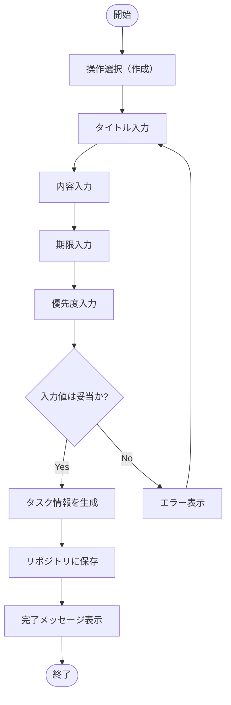
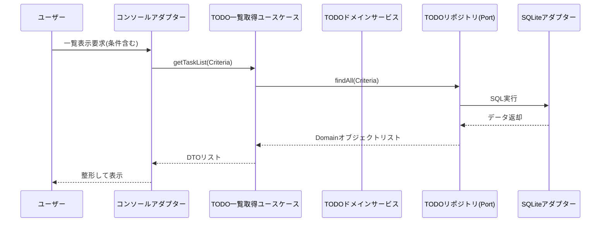
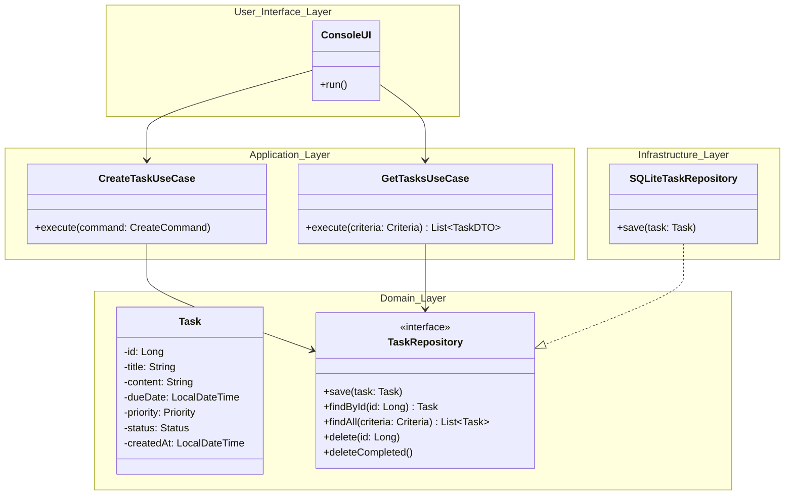

# 基本設計図面

## 1. アクティビティ図（TODO作成）

```mermaid
flowchart TD
    A([開始]) --> B[操作選択（作成）]

    B --> C[タイトル入力]
    C --> D[内容入力]
    D --> E[期限入力]
    E --> F[優先度入力]

    F --> G{入力値は妥当か?}

    G -->|Yes| H[タスク情報を生成]
    H --> I[リポジトリに保存]
    I --> J[完了メッセージ表示]
    J --> K([終了])

    G -->|No| L[エラー表示]
    L --> C

```

## 2. シーケンス図（TODO一覧表示）

```mermaid
sequenceDiagram
    participant User as ユーザー
    participant UI as コンソールアダプター
    participant UseCase as TODO一覧取得ユースケース
    participant Domain as TODOドメインサービス
    participant Repo as TODOリポジトリ(Port)
    participant DB as SQLiteアダプター

    User->>UI: 一覧表示要求(条件含む)
    UI->>UseCase: getTaskList(Criteria)
    UseCase->>Repo: findAll(Criteria)
    Repo->>DB: SQL実行
    DB-->>Repo: データ返却
    Repo-->>UseCase: Domainオブジェクトリスト
    UseCase-->>UI: DTOリスト
    UI-->>User: 整形して表示
```

## 3. クラス図（基本構造）
ヘキサゴナルアーキテクチャの基本構造を示す。

```mermaid
classDiagram
    namespace Domain_Layer {
        class Task {
            -id: Long
            -title: String
            -content: String
            -dueDate: LocalDateTime
            -priority: Priority
            -status: Status
            -createdAt: LocalDateTime
        }
        class TaskRepository {
            +save(task: Task)
            +findById(id: Long) Task
            +findAll(criteria: Criteria) List~Task~
            +delete(id: Long)
            +deleteCompleted()
        }
    }
    <<interface>> TaskRepository

    namespace Application_Layer {
        class CreateTaskUseCase {
            +execute(command: CreateCommand)
        }
        class GetTasksUseCase {
            +execute(criteria: Criteria) List~TaskDTO~
        }
    }

    namespace Infrastructure_Layer {
        class SQLiteTaskRepository {
            +save(task: Task)
        }
    }

    namespace User_Interface_Layer {
        class ConsoleUI {
            +run()
        }
    }

    CreateTaskUseCase --> TaskRepository
    GetTasksUseCase --> TaskRepository
    SQLiteTaskRepository ..|> TaskRepository
    ConsoleUI --> CreateTaskUseCase
    ConsoleUI --> GetTasksUseCase
```
