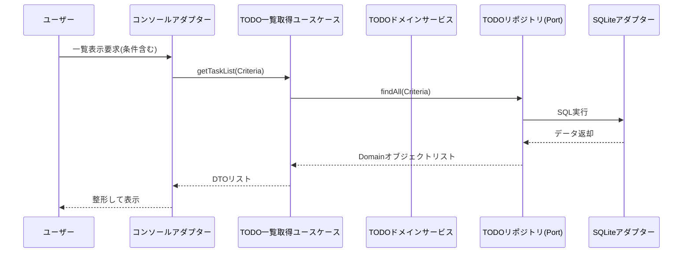

# 基本設計図面

## 1. アクティビティ図（TODO作成）
```mermaid
activityDiagram
    start
    :操作選択（作成）;
    repeat
        :タイトル入力;
        :内容入力;
        :期限入力;
        :優先度入力;
        if (入力値は妥当か?) then (yes)
            :タスク情報を生成;
            :リポジトリに保存;
            :完了メッセージ表示;
            stop
        else (no)
            :エラー表示;
        endif
    repeat while (再試行)
    stop
```

## 2. シーケンス図（TODO一覧表示）


## 3. クラス図（基本構造）
ヘキサゴナルアーキテクチャの基本構造を示す。

```mermaid
classDiagram
    package "Domain Layer" {
        class Task {
            -id: Long
            -title: String
            -content: String
            -dueDate: LocalDateTime
            -priority: Priority
            -status: Status
            -createdAt: LocalDateTime
        }
        class TaskRepository <<interface>> {
            +save(task: Task)
            +findById(id: Long): Task
            +findAll(criteria: Criteria): List~Task~
            +delete(id: Long)
            +deleteCompleted()
        }
    }

    package "Application Layer" {
        class CreateTaskUseCase {
            +execute(command: CreateCommand)
        }
        class GetTasksUseCase {
            +execute(criteria: Criteria): List~TaskDTO~
        }
    }

    package "Infrastructure Layer" {
        class SQLiteTaskRepository {
            +save(task: Task)
            ...
        }
    }

    package "User Interface Layer" {
        class ConsoleUI {
            +run()
        }
    }

    CreateTaskUseCase --> TaskRepository
    GetTasksUseCase --> TaskRepository
    SQLiteTaskRepository ..|> TaskRepository
    ConsoleUI --> CreateTaskUseCase
    ConsoleUI --> GetTasksUseCase
```
