# 基本設計図面（振る舞い）

## 1. アクティビティ図

### UC1: TODOを作成する
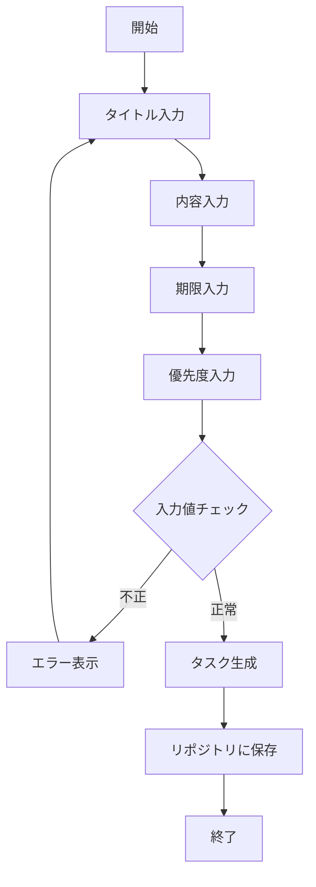

### UC2: TODOを一覧表示する
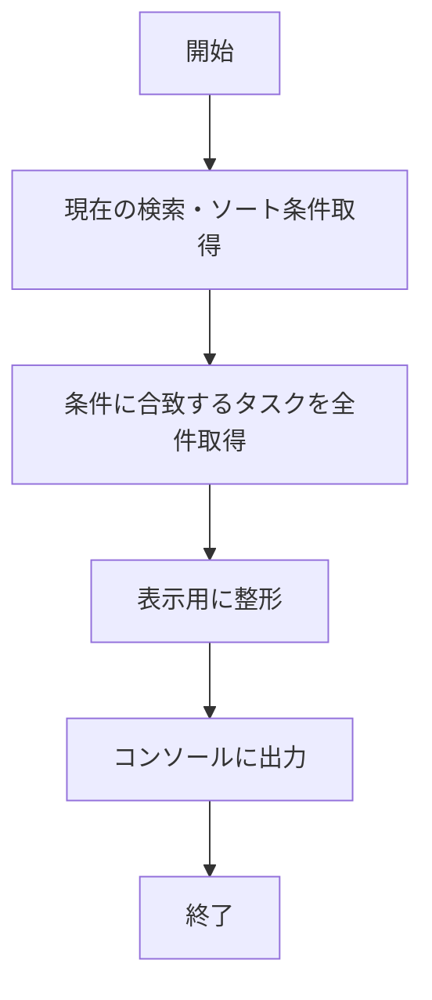

### UC3: TODOを編集する
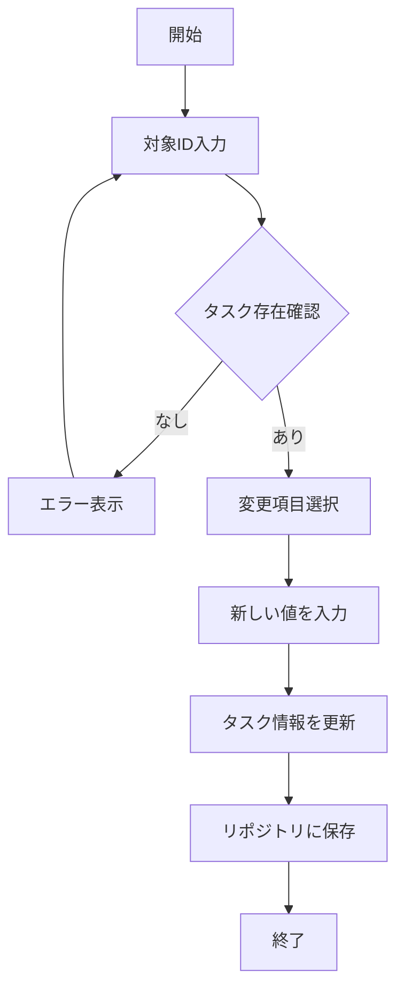

### UC4: TODOを削除する
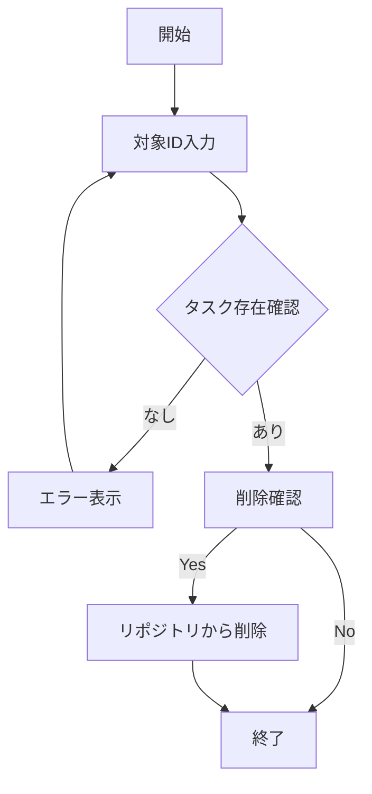

### UC5: 条件で検索・整理する
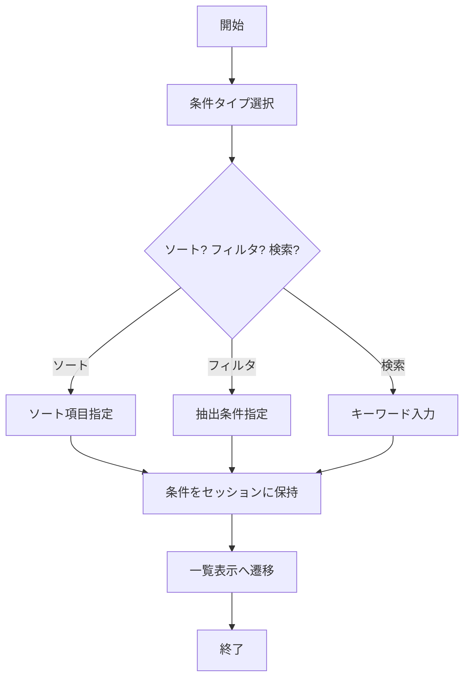

### UC6: 完了済みTODOを一括削除する
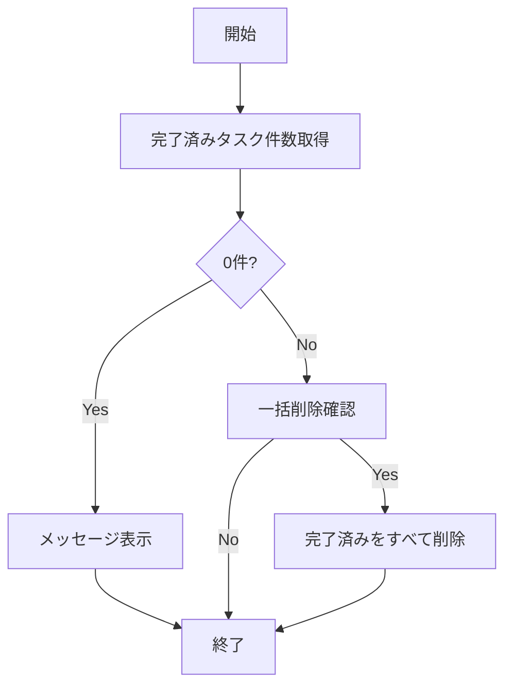

## 2. シーケンス図

### UC1: TODOを作成する
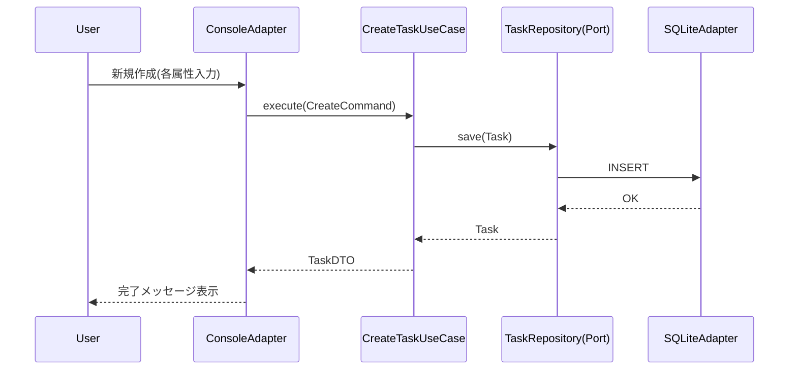

### UC2: TODOを一覧表示する
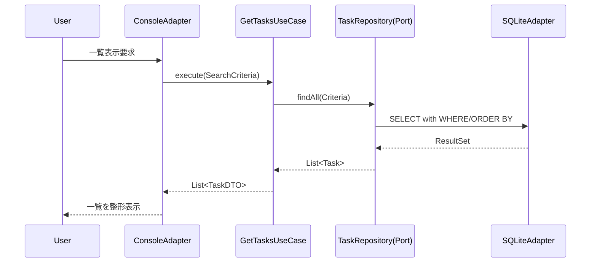

### UC3: TODOを編集する
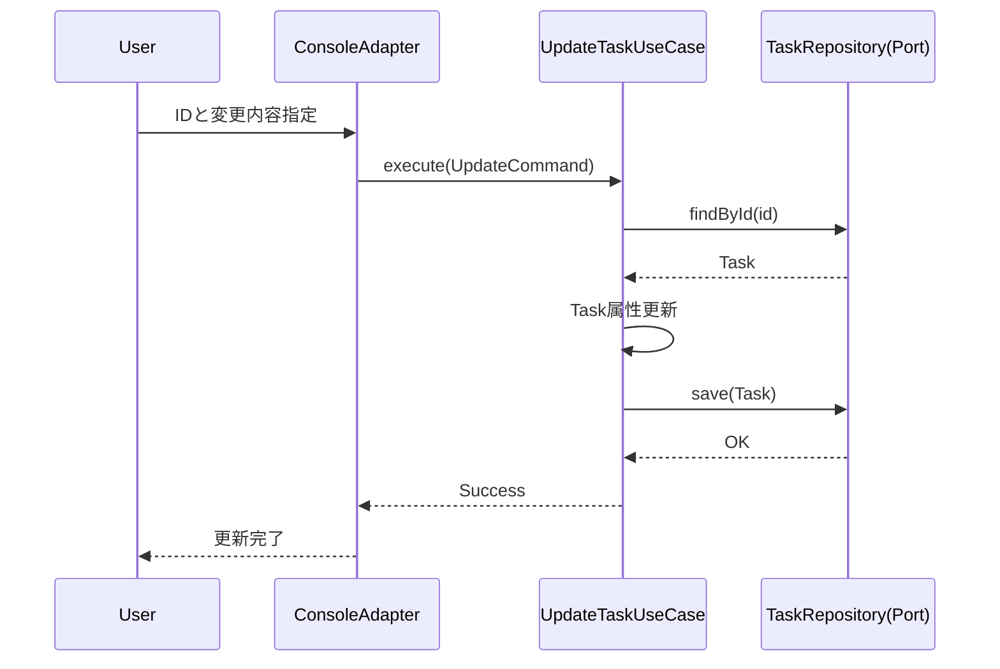

### UC4: TODOを削除する
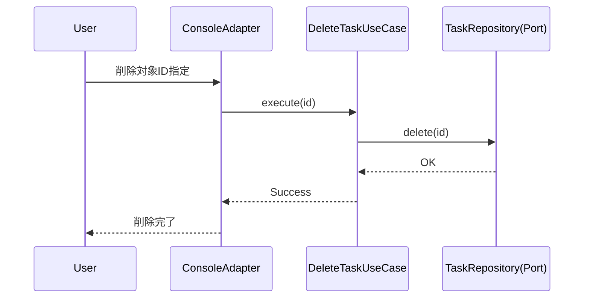

### UC5: 条件で検索・整理する
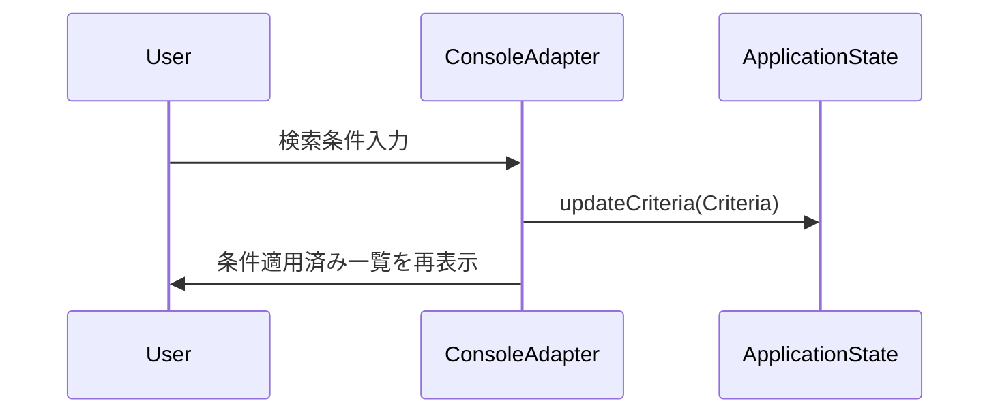

### UC6: 完了済みTODOを一括削除する
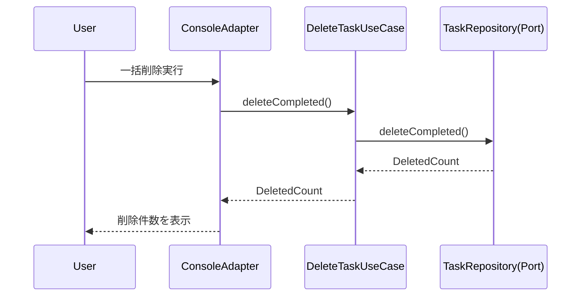
