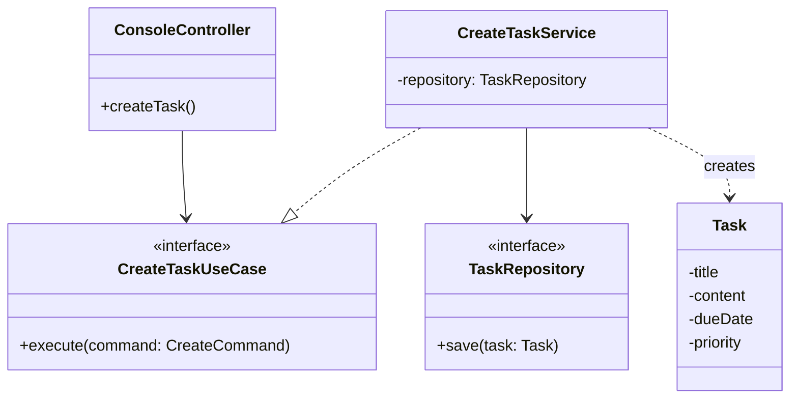
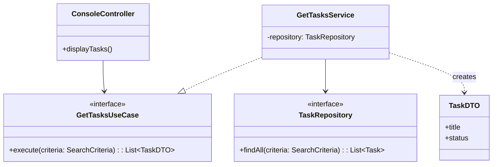
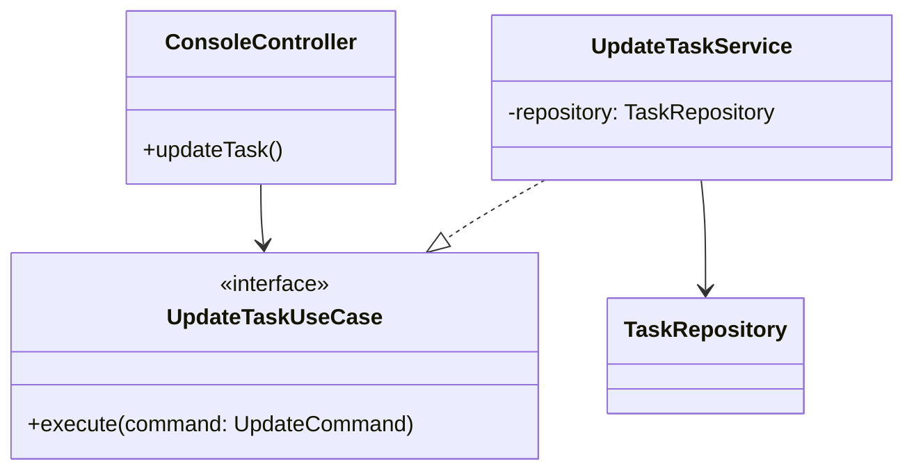
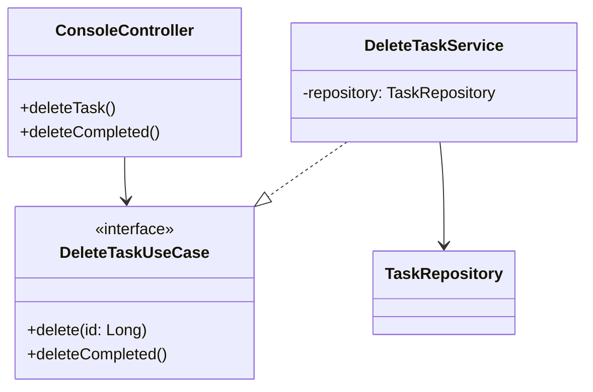
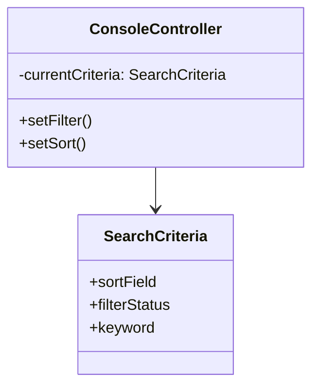

# 基本設計図面（構造 - ユースケース別）

## 1. UC1: TODOを作成する

```mermaid
classDiagram
    class ConsoleController {
        +createTask()
    }
    class CreateTaskUseCase <<interface>> {
        +execute(command: CreateCommand)
    }
    class CreateTaskService {
        -repository: TaskRepository
    }
    class TaskRepository <<interface>> {
        +save(task: Task)
    }
    class Task {
        -title
        -content
        -dueDate
        -priority
    }

    ConsoleController --> CreateTaskUseCase
    CreateTaskService ..|> CreateTaskUseCase
    CreateTaskService --> TaskRepository
    CreateTaskService ..> Task : creates
```

## 2. UC2: TODOを一覧表示する

```mermaid
classDiagram
    class ConsoleController {
        +displayTasks()
    }
    class GetTasksUseCase <<interface>> {
        +execute(criteria: SearchCriteria): List~TaskDTO~
    }
    class GetTasksService {
        -repository: TaskRepository
    }
    class TaskRepository <<interface>> {
        +findAll(criteria: SearchCriteria): List~Task~
    }
    class TaskDTO {
        +title
        +status
    }

    ConsoleController --> GetTasksUseCase
    GetTasksService ..|> GetTasksUseCase
    GetTasksService --> TaskRepository
    GetTasksService ..> TaskDTO : creates
```

## 3. UC3: TODOを編集する

```mermaid
classDiagram
    class ConsoleController {
        +updateTask()
    }
    class UpdateTaskUseCase <<interface>> {
        +execute(command: UpdateCommand)
    }
    class UpdateTaskService {
        -repository: TaskRepository
    }

    ConsoleController --> UpdateTaskUseCase
    UpdateTaskService ..|> UpdateTaskUseCase
    UpdateTaskService --> TaskRepository
```

## 4. UC4: TODOを削除する & UC6: 一括削除

```mermaid
classDiagram
    class ConsoleController {
        +deleteTask()
        +deleteCompleted()
    }
    class DeleteTaskUseCase <<interface>> {
        +delete(id: Long)
        +deleteCompleted()
    }
    class DeleteTaskService {
        -repository: TaskRepository
    }

    ConsoleController --> DeleteTaskUseCase
    DeleteTaskService ..|> DeleteTaskUseCase
    DeleteTaskService --> TaskRepository
```

## 5. UC5: 条件で検索・整理する

```mermaid
classDiagram
    class ConsoleController {
        -currentCriteria: SearchCriteria
        +setFilter()
        +setSort()
    }
    class SearchCriteria {
        +sortField
        +filterStatus
        +keyword
    }

    ConsoleController --> SearchCriteria
```
