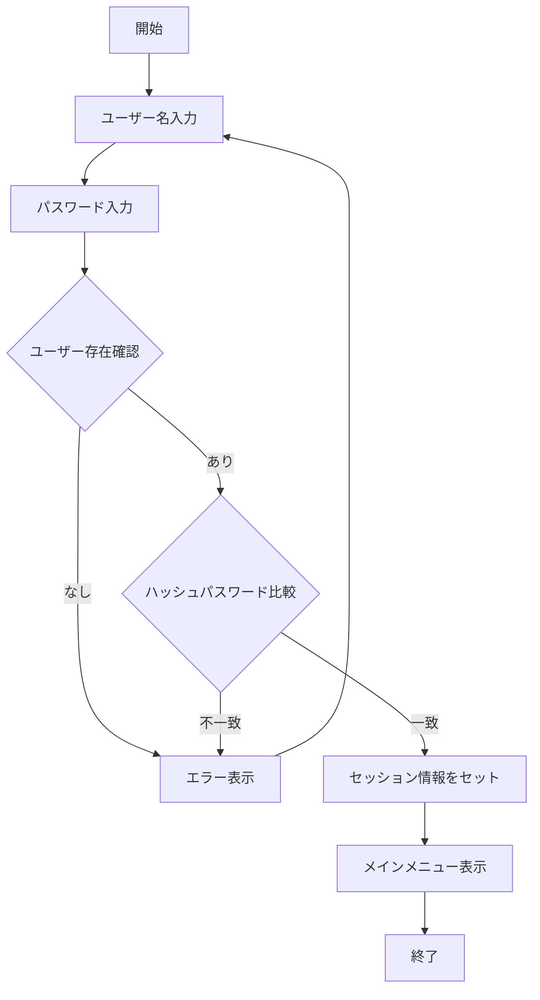
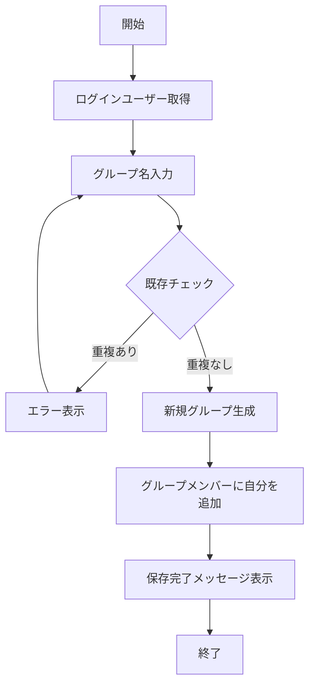
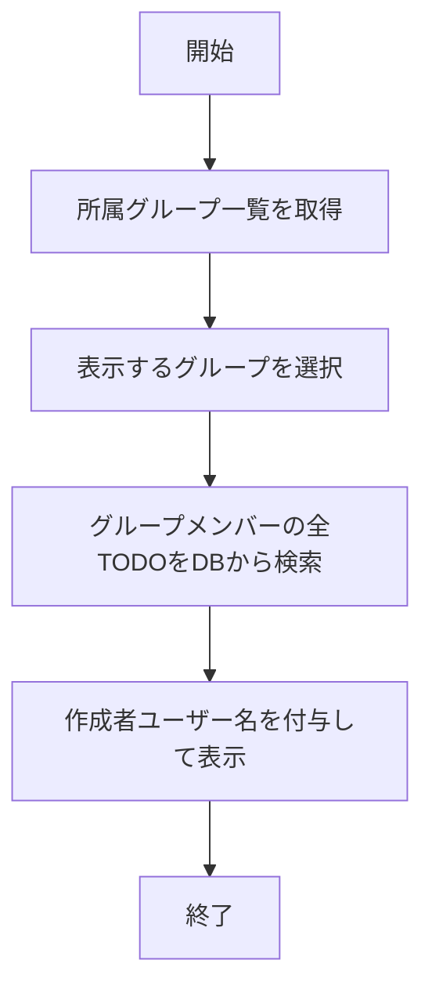
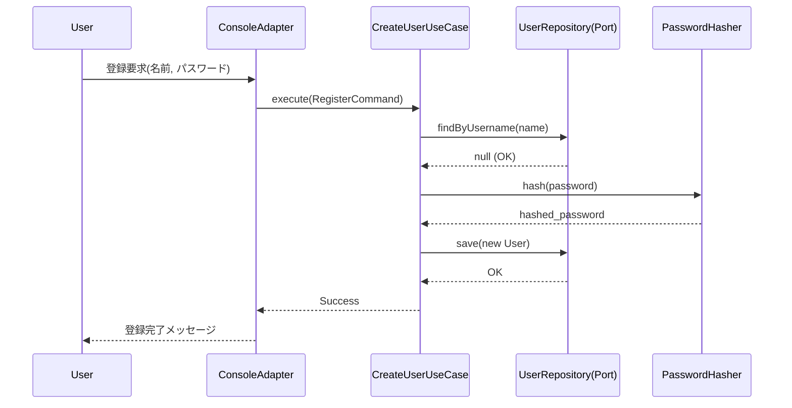
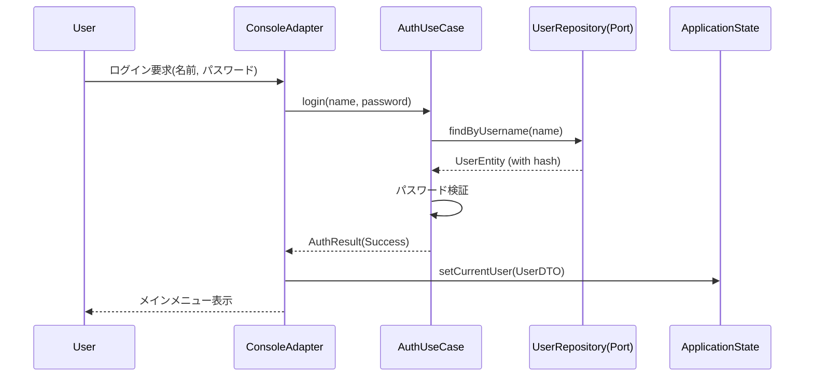
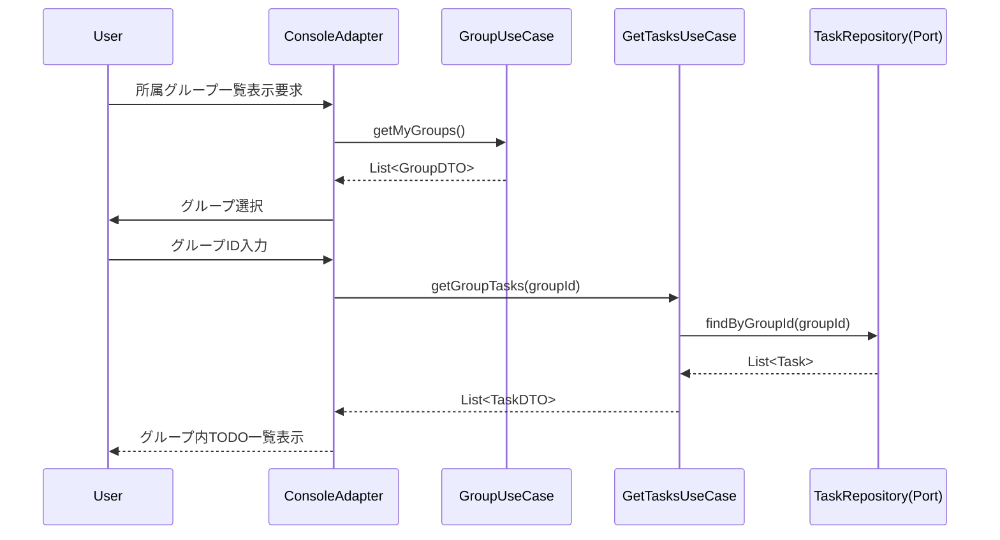

# 基本設計図面（振る舞い ver2: ユーザー・グループ管理）

## 1. アクティビティ図

### UC2: ログインする

```mermaid
flowchart TD
    A[開始] --> B[ユーザー名入力]
    B --> C[パスワード入力]
    C --> D{ユーザー存在確認}
    D -- なし --> E[エラー表示]
    E --> B
    D -- あり --> F{ハッシュパスワード比較}
    F -- 不一致 --> E
    F -- 一致 --> G[セッション情報をセット]
    G --> H[メインメニュー表示]
    H --> I[終了]
```

### UC4: グループを作成する

```mermaid
flowchart TD
    A[開始] --> B[ログインユーザー取得]
    B --> C[グループ名入力]
    C --> D{既存チェック}
    D -- 重複あり --> E[エラー表示]
    E --> C
    D -- 重複なし --> F[新規グループ生成]
    F --> G[グループメンバーに自分を追加]
    G --> H[保存完了メッセージ表示]
    H --> I[終了]
```

### UC6: グループ内TODOを閲覧する

```mermaid
flowchart TD
    A[開始] --> B[所属グループ一覧を取得]
    B --> C[表示するグループを選択]
    C --> D[グループメンバーの全TODOをDBから検索]
    D --> E[作成者ユーザー名を付与して表示]
    E --> F[終了]
```

## 2. シーケンス図

### UC1: ユーザー登録する

```mermaid
sequenceDiagram
    participant User
    participant UI as ConsoleAdapter
    participant UC as CreateUserUseCase
    participant Repo as UserRepository(Port)
    participant Hash as PasswordHasher

    User->>UI: 登録要求(名前, パスワード)
    UI->>UC: execute(RegisterCommand)
    UC->>Repo: findByUsername(name)
    Repo-->>UC: null (OK)
    UC->>Hash: hash(password)
    Hash-->>UC: hashed_password
    UC->>Repo: save(new User)
    Repo-->>UC: OK
    UC-->>UI: Success
    UI-->>User: 登録完了メッセージ
```

### UC2: ログインする

```mermaid
sequenceDiagram
    participant User
    participant UI as ConsoleAdapter
    participant UC as AuthUseCase
    participant Repo as UserRepository(Port)
    participant Session as ApplicationState

    User->>UI: ログイン要求(名前, パスワード)
    UI->>UC: login(name, password)
    UC->>Repo: findByUsername(name)
    Repo-->>UC: UserEntity (with hash)
    UC->>UC: パスワード検証
    UC-->>UI: AuthResult(Success)
    UI->>Session: setCurrentUser(UserDTO)
    UI-->>User: メインメニュー表示
```

### UC6: グループ内TODOを閲覧する

```mermaid
sequenceDiagram
    participant User
    participant UI as ConsoleAdapter
    participant G_UC as GroupUseCase
    participant T_UC as GetTasksUseCase
    participant T_Repo as TaskRepository(Port)

    User->>UI: 所属グループ一覧表示要求
    UI->>G_UC: getMyGroups()
    G_UC-->>UI: List<GroupDTO>
    UI->>User: グループ選択
    User->>UI: グループID入力
    UI->>T_UC: getGroupTasks(groupId)
    T_UC->>T_Repo: findByGroupId(groupId)
    T_Repo-->>T_UC: List<Task>
    T_UC-->>UI: List<TaskDTO>
    UI-->>User: グループ内TODO一覧表示
```
