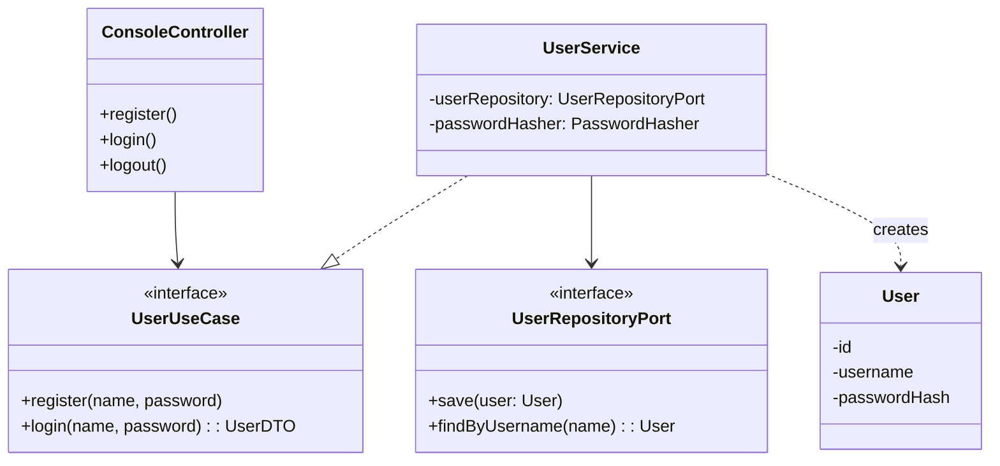
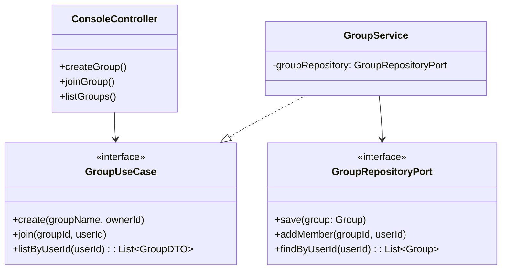
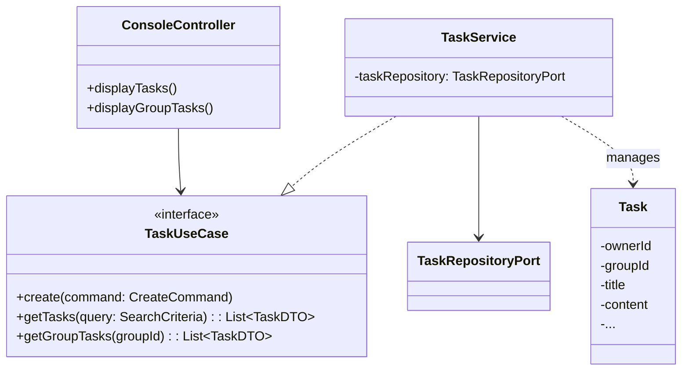

# 基本設計図面（構造 ver2: ユーザー・グループ管理）

## 1. 構造 - ユースケース別クラス図

### UC1/2: ユーザー管理

```mermaid
classDiagram
    class ConsoleController {
        +register()
        +login()
        +logout()
    }
    class UserUseCase <<interface>> {
        +register(name, password)
        +login(name, password): UserDTO
    }
    class UserService {
        -userRepository: UserRepositoryPort
        -passwordHasher: PasswordHasher
    }
    class UserRepositoryPort <<interface>> {
        +save(user: User)
        +findByUsername(name): User
    }
    class User {
        -id
        -username
        -passwordHash
    }

    ConsoleController --> UserUseCase
    UserService ..|> UserUseCase
    UserService --> UserRepositoryPort
    UserService ..> User : creates
```

### UC4/5: グループ管理

```mermaid
classDiagram
    class ConsoleController {
        +createGroup()
        +joinGroup()
        +listGroups()
    }
    class GroupUseCase <<interface>> {
        +create(groupName, ownerId)
        +join(groupId, userId)
        +listByUserId(userId): List~GroupDTO~
    }
    class GroupService {
        -groupRepository: GroupRepositoryPort
    }
    class GroupRepositoryPort <<interface>> {
        +save(group: Group)
        +addMember(groupId, userId)
        +findByUserId(userId): List~Group~
    }

    ConsoleController --> GroupUseCase
    GroupService ..|> GroupUseCase
    GroupService --> GroupRepositoryPort
```

### UC3/6: TODO管理 (拡張)

```mermaid
classDiagram
    class ConsoleController {
        +displayTasks()
        +displayGroupTasks()
    }
    class TaskUseCase <<interface>> {
        +create(command: CreateCommand)
        +getTasks(query: SearchCriteria): List~TaskDTO~
        +getGroupTasks(groupId): List~TaskDTO~
    }
    class TaskService {
        -taskRepository: TaskRepositoryPort
    }
    class Task {
        -ownerId
        -groupId
        -title
        -content
        -...
    }

    ConsoleController --> TaskUseCase
    TaskService ..|> TaskUseCase
    TaskService --> TaskRepositoryPort
    TaskService ..> Task : manages
```
