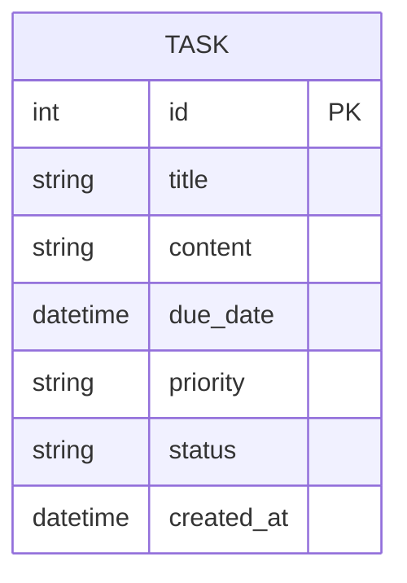
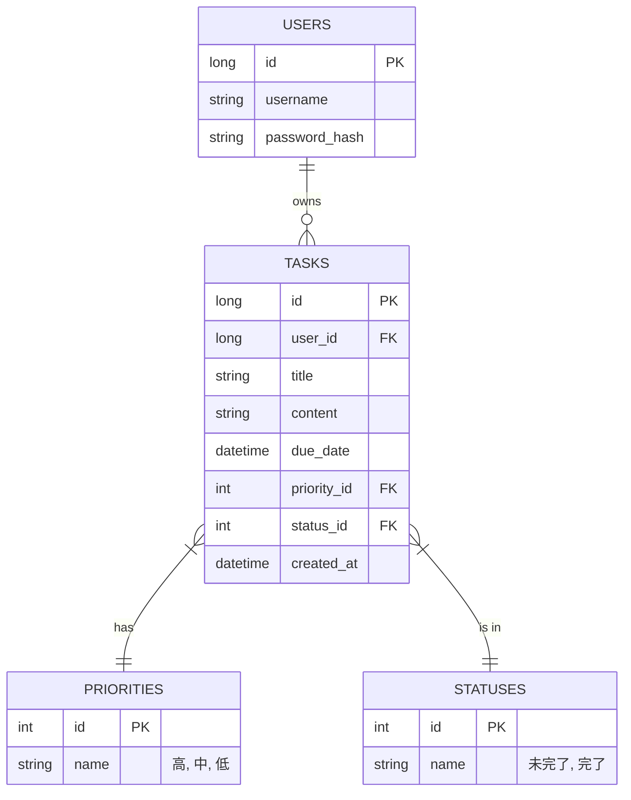

# 詳細設計（ER図・論理設計）

## 1. 概念設計（再掲）
要求分析段階でのER図。

## 2. 第三正規化の検討
今回のTODOリストは、現状では単一のエンティティで完結している。
しかし、将来的な拡張性（ユーザー管理）を考慮し、また「優先度」や「ステータス」をマスタ化することを検討する。

### 第1正規化 (1NF)
- 繰り返しグループの排除、すべての属性が原子値であること。
- 達成済み。

### 第2正規化 (2NF)
- 部分関数従属性の排除。
- 主キー(id)に対してすべての属性が完全関数従属しているため、達成済み。

### 第3正規化 (3NF)
- 推移的関数従属性の排除。
- 現状では「優先度コード」に対して「優先度名」が決まるような構造はないが、拡張性を考慮してマスタ化する。

## 3. 論理設計ER図（第三正規化後）
将来のユーザー管理を見据えた構成。

※ プロトタイプ（ver1）では、USERSテーブルは作成せず、TASKSテーブル内に直接情報を保持する形（または固定のuser_id 1を使用）で実装するが、設計上は上記を正とする。
SQLiteの実装においては、シンプルさのためPRIORITIESやSTATUSESも文字列としてTASKSに埋め込む形式を採用する場合もあるが、論理設計としては分離する。
