# 詳細設計（統合クラス図）

## 1. 統合クラス図（ヘキサゴナルアーキテクチャ）
全ユースケースと、疎結合にするためのインターフェース、DTO、永続化層のエンティティを含めた最終的な構成です。

```mermaid
classDiagram
    %% --- User Interface Layer ---
    namespace Infrastructure_Adapters_In_Console {
        class ConsoleController {
            -createTaskUseCase: CreateTaskInputPort
            -getTasksUseCase: GetTasksInputPort
            -updateTaskUseCase: UpdateTaskInputPort
            -deleteTaskUseCase: DeleteTaskInputPort
            +start()
            -handleCreate()
            -handleList()
        }
    }

    %% --- Application Layer (Input Ports) ---
    namespace Application_Ports_In {
        class CreateTaskInputPort {
            +execute(command: CreateTaskCommand)
        }
        class GetTasksInputPort {
            +execute(query: SearchCriteria) List~TaskDTO~
        }
        class UpdateTaskInputPort {
            +execute(command: UpdateTaskCommand)
        }
        class DeleteTaskInputPort {
            +delete(id: Long)
            +deleteCompleted()
        }
    }
    <<interface>> CreateTaskInputPort
    <<interface>> GetTasksInputPort
    <<interface>> UpdateTaskInputPort
    <<interface>> DeleteTaskInputPort

    %% --- Application Layer (Services) ---
    namespace Application_Services {
        class TaskService {
            -repository: TaskRepositoryPort
        }
    }

    %% --- Application Layer (DTOs & Commands) ---
    namespace Application_DTOs {
        class TaskDTO {
            +Long id
            +String title
            +String content
            +String dueDate
            +String priority
            +String status
            +String createdAt
        }
        class CreateTaskCommand {
            +String title
            +String content
            +LocalDateTime dueDate
            +Priority priority
        }
        class SearchCriteria {
            +String sortField
            +String filterStatus
            +String keyword
        }
    }

    %% --- Domain Layer ---
    namespace Domain_Models {
        class Task {
            -TaskId id
            -String title
            -String content
            -LocalDateTime dueDate
            -Priority priority
            -Status status
            -LocalDateTime createdAt
            +complete()
            +updateDetails(...)
        }
        class Priority {
            HIGH
            MEDIUM
            LOW
        }
        class Status {
            TODO
            DONE
        }
    }
    <<enumeration>> Priority
    <<enumeration>> Status

    %% --- Application Layer (Output Ports) ---
    namespace Application_Ports_Out {
        class TaskRepositoryPort {
            +save(task: Task)
            +findById(id: Long) Task
            +findAll(criteria: SearchCriteria) List~Task~
            +delete(id: Long)
            +deleteCompleted()
        }
    }
    <<interface>> TaskRepositoryPort

    %% --- Infrastructure Layer (Adapters Out) ---
    namespace Infrastructure_Adapters_Out_Persistence {
        class SQLiteTaskRepository {
            -Connection connection
            +save(task: Task)
        }
        class TaskDbEntity {
            +Long id
            +String title
            +String content
            +Long dueDateEpoch
            +String priority
            +String status
            +Long createdAtEpoch
        }
    }

    %% --- Relationships ---
    ConsoleController --> CreateTaskInputPort
    ConsoleController --> GetTasksInputPort
    ConsoleController --> UpdateTaskInputPort
    ConsoleController --> DeleteTaskInputPort

    TaskService ..|> CreateTaskInputPort
    TaskService ..|> GetTasksInputPort
    TaskService ..|> UpdateTaskInputPort
    TaskService ..|> DeleteTaskInputPort

    TaskService --> TaskRepositoryPort
    TaskService --> Task : manages
    TaskService ..> TaskDTO : creates

    SQLiteTaskRepository ..|> TaskRepositoryPort
    SQLiteTaskRepository ..> TaskDbEntity : uses
    SQLiteTaskRepository ..> Task : maps to/from
```

## 2. 設計のポイント
- **疎結合性**: UI（ConsoleController）は Application Layer のインターフェース（InputPort）にのみ依存し、具象クラスである `TaskService` には依存していません。
- **ドメイン隔離**: `Task` エンティティは純粋なビジネスロジックを保持し、フレームワークやデータベースの都合（アノテーション等）に依存しません。
- **データ変換**: `TaskDTO` を用いてUI層にデータを渡すことで、ドメインモデルの内部構造がUI層に漏れるのを防いでいます。また、`TaskDbEntity`（または直接のSQL操作）を用いてデータベースの物理構造とドメインモデルを分離しています。
- **拡張性**: 永続化先を将来的に PostgreSQL 等に変更する場合も、`TaskRepositoryPort` を実装した新しいアダプターを作成するだけで済み、ビジネスロジックへの影響はありません。
