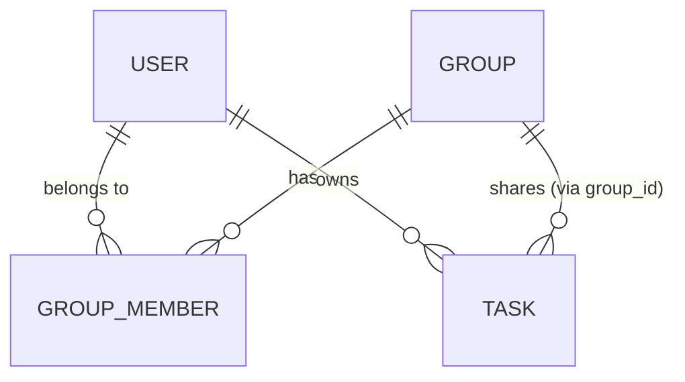
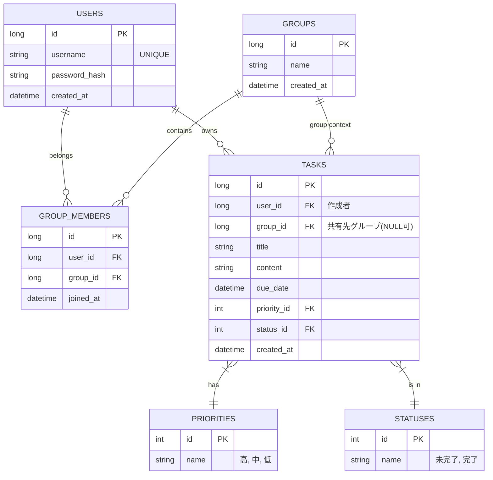

# 詳細設計 (ER図・論理設計 ver2: ユーザー・グループ管理)

## 1. 概念設計（再掲）
ver2での主要なエンティティ間の関係。

## 2. 第三正規化の検討
正規化プロセスを通じて、データの一貫性と整合性を確保する。

### 第1正規化 (1NF)
- 属性の原子化。各属性は単一の値を持つ。
- すべてのテーブルにおいて達成済み。

### 第2正規化 (2NF)
- 部分関数従属性の排除。
- すべての非主キー属性が主キーに対して完全関数従属している。
- 例: `GROUP_MEMBER` では、`(user_id, group_id)` の複合キー、またはサロゲートキー `id` を使用することで達成。

### 第3正規化 (3NF)
- 推移的関数従属性の排除。
- 非キー属性が他の非キー属性に従属していないこと。
- `TASKS` テーブルにおいて、`priority_id` や `status_id` を介してそれぞれの「名称」が決まる場合、それらを別テーブルに分離することで達成（ver1の論理設計に基づき継続）。

## 3. 論理設計ER図（第三正規化後）
ver2での完成形。

※ 実装上の単純化のため、プロトタイプでは `PRIORITIES` や `STATUSES` を `TASKS` 内の文字列カラムとして保持する場合があるが、正規化されたモデルとしては上記を正とする。
また、`GROUP_MEMBERS` には複合ユニーク制約 `(user_id, group_id)` を設定し、一人が同じグループに複数回所属することを防ぐ。
