# 詳細設計 (統合クラス図 ver2: ユーザー・グループ管理)

## 統合クラス図 (ヘキサゴナルアーキテクチャ ver2)
新機能（ユーザー・グループ管理）を追加し、既存のTODO機能を拡張した最終的なクラス構成。

```mermaid
classDiagram
    %% --- Infrastructure Layer (In Adapters) ---
    namespace Infrastructure_Adapters_In_Console {
        class ConsoleController {
            -userInputPort: UserInputPort
            -groupInputPort: GroupInputPort
            -taskInputPort: TaskInputPort
            -session: SessionState
            +start()
            -handleAuth()
            -handleTodoMenu()
            -handleGroupMenu()
        }
    }

    %% --- Application Layer (Input Ports) ---
    namespace Application_Ports_In {
        class UserInputPort <<interface>> {
            +register(command: RegisterCommand)
            +login(command: LoginCommand): UserDTO
        }
        class GroupInputPort <<interface>> {
            +createGroup(command: CreateGroupCommand)
            +joinGroup(command: JoinGroupCommand)
            +getMyGroups(userId: Long): List~GroupDTO~
        }
        class TaskInputPort <<interface>> {
            +createTask(command: CreateTaskCommand)
            +getTasks(query: SearchQuery): List~TaskDTO~
            +getGroupTasks(groupId: Long): List~TaskDTO~
        }
    }

    %% --- Application Layer (Services) ---
    namespace Application_Services {
        class UserService {
            -userRepository: UserRepositoryPort
            -passwordHasher: PasswordHasher
        }
        class GroupService {
            -groupRepository: GroupRepositoryPort
        }
        class TaskService {
            -taskRepository: TaskRepositoryPort
        }
    }

    %% --- Domain Layer ---
    namespace Domain_Models {
        class User {
            -UserId id
            -String username
            -String passwordHash
            +authenticate(password, hasher)
        }
        class Group {
            -GroupId id
            -String name
            -List~UserId~ members
        }
        class Task {
            -TaskId id
            -UserId ownerId
            -GroupId groupId
            -String title
            -Status status
            -...
            +complete()
        }
    }

    %% --- Application Layer (Output Ports) ---
    namespace Application_Ports_Out {
        class UserRepositoryPort <<interface>> {
            +save(user: User)
            +findByUsername(name: String): User
        }
        class GroupRepositoryPort <<interface>> {
            +save(group: Group)
            +addMember(groupId, userId)
            +findByUserId(userId): List~Group~
            +findById(groupId): Group
        }
        class TaskRepositoryPort <<interface>> {
            +save(task: Task)
            +findByUserId(userId): List~Task~
            +findByGroupId(groupId): List~Task~
            +delete(taskId)
        }
    }

    %% --- Infrastructure Layer (Out Adapters) ---
    namespace Infrastructure_Adapters_Out_Persistence {
        class SQLiteUserRepository {
            -Connection connection
        }
        class SQLiteGroupRepository {
            -Connection connection
        }
        class SQLiteTaskRepository {
            -Connection connection
        }
    }

    %% --- Relationships ---
    ConsoleController --> UserInputPort
    ConsoleController --> GroupInputPort
    ConsoleController --> TaskInputPort

    UserService ..|> UserInputPort
    GroupService ..|> GroupInputPort
    TaskService ..|> TaskInputPort

    UserService --> UserRepositoryPort
    GroupService --> GroupRepositoryPort
    TaskService --> TaskRepositoryPort

    SQLiteUserRepository ..|> UserRepositoryPort
    SQLiteGroupRepository ..|> GroupRepositoryPort
    SQLiteTaskRepository ..|> TaskRepositoryPort

    TaskService ..> Task : manages
    GroupService ..> Group : manages
    UserService ..> User : manages
```

## 設計のポイント (ver2)
- **セッション管理**: `ConsoleController` が保持する `SessionState` (または `ApplicationState`) により、現在ログイン中のユーザーIDを追跡し、各ユースケース実行時にコンテキストとして提供する。
- **データアクセスの分離**: ユーザー、グループ、タスクの各リポジトリを分離し、責務を明確にする。
- **共有ロジック**: `Task` エンティティが `groupId` を保持することで、個人用タスク（groupId=null）とグループ用タスクを区別し、共有範囲を制御する。
- **パスワード保護**: `PasswordHasher` を Application Layer で使用し、ドメインモデルの認証メソッドに注入することで、安全なパスワード比較を担保する。
